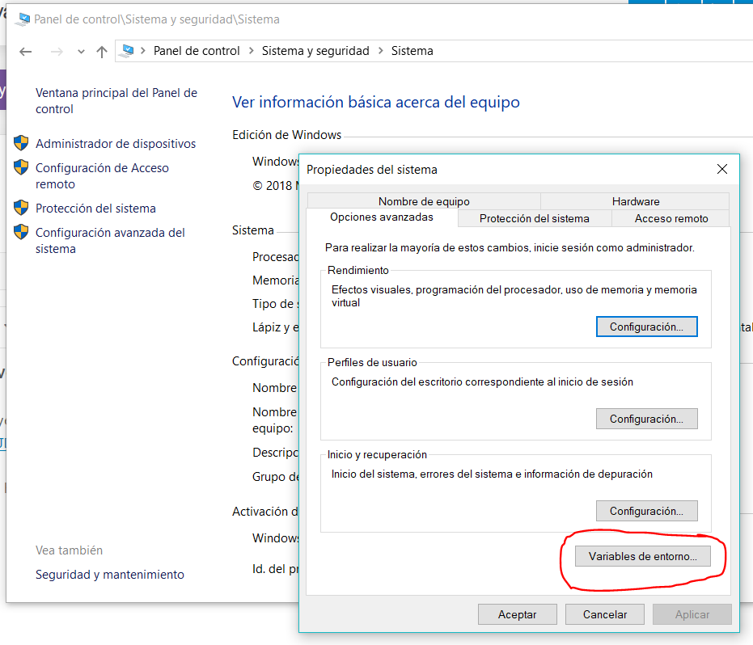
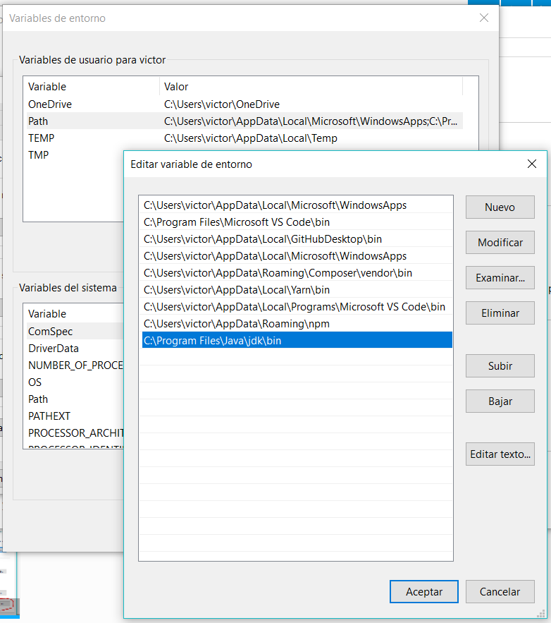

[toc]
## Java Development Kit (JDK)

El JDK incluye todo lo necesario para desarrollar en Java de Oracle. Utilizaremos la versión SE (Standard Edition)  
 - Enlace: [JDK Java SE](https://www.oracle.com/technetwork/java/javase/downloads/index.html)

Para que las herramientas de Java puedan ser utilizadas desde el Símbolo del sistema es necesario ajustar la variable
de entorno PATH, que indica las rutas en las que el sistema operativo buscará los ejecutables.
En Windows se ajusta en el _Panel de control / Sistema y seguridad / Sistema / Configuración avanzada del sistema_. Una vez ahí, abrimos las
variables de entorno.
(En windows 10 también puedes escribir en la barra de Cortana "Editar las variables de entorno del sistema" para acceder directamente).

Añade la ruta de la carpeta **bin** del directorio donde hayas instalado el JDK.

### El compilador
Es el programa `javac`, que se encuentra en la carpeta _bin_ del jdk.

* `javac -version` muestra la versión del compilador
* `javac TuClase.java` compila el fichero _TuClase.java_ y genera el fichero _TuClase.class_, que puede ser cargado por el intérprete
* Si hay errores sintácticos, el compilador emitirá un mensaje de error junto con la línea y la columna a partir de la cual no puede seguir compilando

### El intérprete
También se encuentra en la carpeta _bin_, y su nombre es `java`

* `java -version` muestra la versión
* `java TuClase` carga la clase y si ésta tiene un método _main_ lo ejecuta

## IDEs
Pueden encontrarse varios entornos de desarrollo para Java. Nosotros utilizaremos **NetBeans**, de la fundación _**Apache**_.
* [IntelliJ IDEA](https://www.jetbrains.com/idea/)
* [Eclipse](http://www.eclipse.org/)
* [Apache NetBeans.](https://netbeans.apache.org/)

